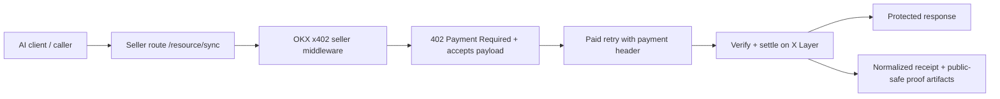

# x402-paywall-skill

`x402-paywall-skill` is a seller-side X Layer payment skill for the OKX Build X
Hackathon Human Track / Skills Arena. It turns one protected route into a paid
resource with the official OKX x402 seller flow, then writes a normalized
seller receipt plus a public-safe proof bundle for review.

The submission is intentionally narrow:

- one hero route: `GET /resource/sync`
- one X Layer payment flow
- one normalized seller receipt contract
- one public-safe proof pack that judges can inspect quickly

It does not try to be a buyer wallet product, admin dashboard, or generic
multi-route monetization platform.

## 1. Project Intro

This repo packages the seller side of an x402 paywall flow on X Layer. The goal
is simple: give an AI-facing service one paid route that can:

1. return `402 Payment Required`
2. verify the paid retry through the official OKX seller path
3. settle on X Layer
4. return the protected payload
5. persist proof-ready seller artifacts

For this version, the scope stays deliberately tight so the review surface is
easy to understand and verify.

## 2. Architecture Overview



Core repo responsibilities:

- define one paid route with X Layer network metadata
- expose a consistent seller receipt contract from `src/index.ts`
- capture proof artifacts under `artifacts/hero-runs/`
- keep the public story centered on the seller flow, not on buyer tooling

## 3. Deployment Status / Seller Address

This submission is a reusable skill package, not a standalone deployed smart
contract. The reviewable deployment/proof identity for this version is the
seller wallet plus the verified X Layer settlement evidence.

- Track / Arena: `Human Track / Skills Arena`
- Network: `eip155:196` (`X Layer Mainnet`)
- Hero route: `GET /resource/sync`
- Dedicated seller `PAY_TO_ADDRESS`:
  `0x1300e5D8E8126c613b82b4F02f138cbdF76FDeb5`
- Hero payment asset:
  `USDT` on X Layer
  (`0x779ded0c9e1022225f8e0630b35a9b54be713736`)
- Current live proof tx:
  `0x32afa7675ac0c3806bb07bf4de55dd26523f10572c037a3429e11f8c56a786b4`

Public-safe proof reference:

- manifest:
  `artifacts/hero-runs/2026-04-15T05-36-07-866Z/public-safe/manifest.json`
- summary:
  `artifacts/hero-runs/2026-04-15T05-36-07-866Z/public-safe/proof-summary.md`

## 4. OKX / OnchainOS Skill Usage

The repo is built on the official OKX x402 seller stack:

- `@okxweb3/x402-core`
- `@okxweb3/x402-express`
- `@okxweb3/x402-evm`

The seller flow follows the official OKX payment model for:

- issuing a `402` requirement
- verifying the paid retry
- settling on X Layer
- recording a seller-owned receipt and proof bundle

Primary repo commands:

```bash
pnpm typecheck
pnpm test
pnpm hero:fallback
pnpm hero:live
```

What this repo claims:

- seller-side x402 payment requirement and settlement flow
- proof-ready seller artifacts for one X Layer route

What this repo does not claim:

- buyer-side wallet orchestration as a product
- autonomous multi-route monetization
- generic seller dashboard or admin tooling

## 5. Working Mechanics

### Hero flow

1. define the hero route with X Layer metadata, seller payout address, and
   asset details
2. return `402 Payment Required` for `GET /resource/sync`
3. accept the paid retry and verify it through the OKX seller path
4. settle the payment on X Layer
5. return the protected response
6. write a normalized seller receipt plus public-safe proof artifacts

### Protected response contract

```json
{
  "ok": true,
  "routeId": "resource-sync",
  "resource": "premium X Layer seller payload"
}
```

### Artifact contract

- `artifacts/hero-runs/latest.json` points to the latest proof bundle
- `publicArtifactPath` points to the judge-safe bundle
- `rawArtifactPath` keeps the local full bundle for deeper inspection
- `hero:fallback` preserves the same schema with
  `settlementState = fallback_local`

## 6. Proof Of Work

The current public-safe proof set shows:

- route: `resource-sync`
- mode: `live`
- status: `settled`
- settlement state: `settled_onchain`
- payer:
  `0xa301291889d560df0bbd4ac2939ec7a78f1f3ff6`
- seller pay-to:
  `0x1300e5D8E8126c613b82b4F02f138cbdF76FDeb5`
- X Layer tx:
  `0x32afa7675ac0c3806bb07bf4de55dd26523f10572c037a3429e11f8c56a786b4`

This submission proves that one seller-owned X Layer route can:

- issue a real `402` requirement
- verify and settle a paid retry
- produce a normalized seller receipt
- expose a public-safe proof bundle for review

## 7. Team Info

- Public GitHub repo:
  [unlock-route/x402-paywall-skill](https://github.com/unlock-route/x402-paywall-skill)
- Public maintainer:
  [`@ianmark89`](https://github.com/ianmark89)
- Contact email:
  `REPLACE_WITH_PUBLIC_EMAIL_BEFORE_SUBMIT`
- Telegram:
  `REPLACE_WITH_PUBLIC_TELEGRAM_BEFORE_SUBMIT`
- Submission lane:
  `x402-paywall-skill`
- Team context:
  `buildx-team / unlock-route`

## 8. Why It Matters For X Layer

X Layer needs reusable agent-facing payment building blocks, not only end-user
apps. This repo packages one narrow seller-side monetization path that other
agent workflows can understand quickly:

- one route
- one payment requirement
- one X Layer settlement proof
- one receipt/proof contract that is easy to audit

That makes it a better fit for the Skills Arena than a broader product claim,
while still showing real X Layer payment activity and official OKX payment-stack
integration.
